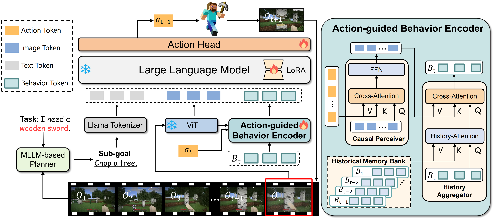
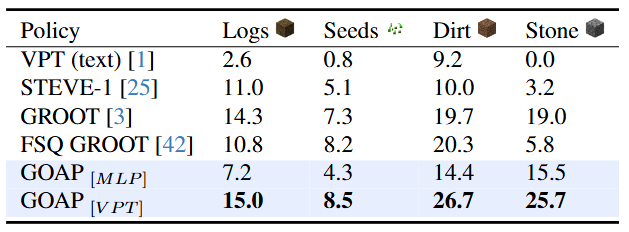
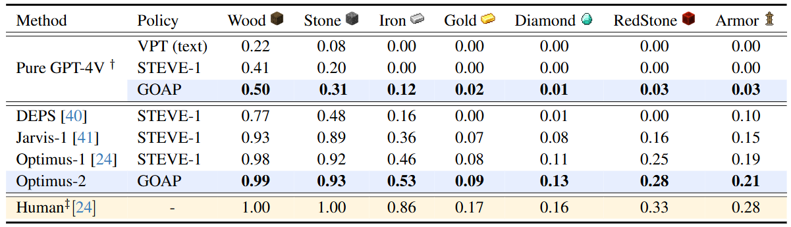
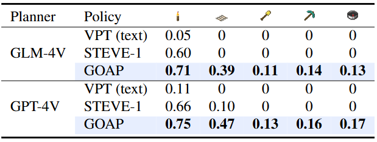

<div align="center">
<h2 align="center">
    <b>Optimus-2: Multimodal Minecraft Agent with Goal-Observation-
     <br />  Action Conditioned Policy
   <br /> <font size=3>CVPR 2025 </font></b> 
</h2>
<div>
<a target="_blank" href="https://scholar.google.com/citations?user=TDBF2UoAAAAJ&hl=en&oi=ao">Zaijing&#160;Li</a><sup>1 2</sup>,
<a target="_blank" href="https://scholar.google.com/citations?user=KO77A2oAAAAJ&hl=en">Yuquan&#160;Xie</a><sup>1</sup>,
<a target="_blank" href="https://scholar.google.com/citations?user=9Vc--XsAAAAJ&hl=en&oi=ao">Rui&#160;Shao</a><sup>1&#9993</sup>,
<a target="_blank" href="https://scholar.google.com/citations?user=Mpg0w3cAAAAJ&hl=en&oi=ao">Gongwei&#160;Chen</a><sup>1</sup>,
<br>
<a target="_blank" href="https://scholar.google.com/citations?hl=en&user=Awsue7sAAAAJ">Dongmei&#160;Jiang</a><sup>2</sup>,
 <a target="_blank" href="https://scholar.google.com/citations?hl=en&user=yywVMhUAAAAJ">Liqiang&#160;Nie</a><sup>1&#9993</sup>
</div>
<sup>1</sup>Harbin Institute of Technology,Shenzhen&#160&#160&#160</span>
<sup>2</sup>Peng Cheng Laboratory, Shenzhen</span>
<br />
<sup>&#9993&#160;</sup>Corresponding author&#160;&#160;</span>
<br/>
<div align="center">
    <a href="https://arxiv.org/abs/2502.19902" target="_blank">
    </a>
    <a href="https://cybertronagent.github.io/Optimus-1.github.io/" target="_blank">
    </a>
</div>
</div>


## :new: Updates
- [02/2025] :fire: [Arxiv paper](https://arxiv.org/abs/2502.19902) released.


## :balloon: Optimus-2 Framework
we propose Optimus-2, a novel Minecraft agent that incorporates a Multimodal Large Language Model (MLLM) for high-level planning, alongside a Goal-Observation-Action Conditioned Policy (GOAP) for low-level control. GOAP contains (1) an Action-guided Behavior Encoder that models causal relationships between observations and actions at each timestep, then dynamically interacts with the historical observation-action sequence, consolidating it into fixed-length behavior tokens, and (2) an MLLM that aligns behavior tokens with open-ended language instructions to predict actions auto-regressively.


## :smile_cat: Evaluation results
We report the `average rewards (AR)` for Atomic Tasks, `average success rate (SR)` for Long-Horizon Tasks and Open-Ended Instruction Tasks.

Table 1: Main Result of GOAP on Atomic Tasks.


Table 2: Main Result of Optimus-2 on Long-Horizon Tasks.


Table 3: Main Result of Optimus-2 on Open-Ended Instruction Tasks.


## :hugs: Citation

If you find this work useful for your research, please kindly cite our paper:

```
@inproceedings{li2025optimus2,
title={Optimus-2: Multimodal Minecraft Agent with Goal-Observation-Action Conditioned Policy},
author={Li, Zaijing and Xie, Yuquan and Shao, Rui and Chen, Gongwei and Jiang, Dongmei and Nie, Liqiang},
booktitle={2025 IEEE/CVF Conference on Computer Vision and Pattern Recognition (CVPR)},
year={2025},
organization={IEEE}
}
```


